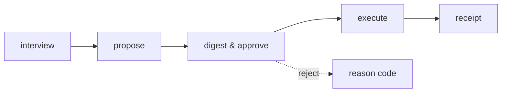

# Aegis Agent

A local-first cognitive twin CLI — a single operator's profile, six proposing specialists, and a human approval gate.

## Pipeline



1. **Interview** — a Day-0 session builds the tenant profile (`core/twin_interview.py`).
2. **Propose** — six specialists propose actions only; nothing executes on its own (`core/twin_actions.py`).
3. **Digest & approve** — the operator reviews the proposed action and approves it, or rejects with a reason code (`duplicate`, `stale`, `unsafe`, `other`).
4. **Execute** — an approved action runs and writes a local outbox file or a `receipts/{action_id}.md` file; nothing sends externally.
5. **Receipt** — every execution produces a local markdown receipt under `AEGIS_DATA_DIR`.

---

## Shipped vs Not shipped

| Shipped | Not shipped |
|---------|-------------|
| Six specialists (Alina, Kian, Bita, Aylin, Ahmad, Amin) propose only | Hosted multi-tenant SaaS / billing / card-charging |
| EchoProvider default LLM (offline echo) | Cloud LLM as default |
| HTTP provider (optional, env-gated) | Payment or license logic inside Aegis |
| Email send to local outbox only | Live SMTP send |
| SQLite persistence under `AEGIS_DATA_DIR` | Packaged desktop app installer |
| Local markdown work products (brief, memo, resume, …) | LangGraph orchestration |
| Hash-bound approve + tenant bind | `desktop_engine.py` and `.market` (quarantined leftovers) |
| Local guards: `complete_safe`, `redact_secrets`, `SecurityPolicy` | |

> `desktop_engine.py` and the `.market` market directory remain in the tree for quarantine tests only — they are not wired into the product and call no external service.

---

## Now

A local digital-twin operator — not a store installer, not a cloud brain. Today it ships:

- **Six specialists propose only** — Alina, Kian, Bita, Aylin, Ahmad, Amin; nothing executes without a human approval gate.
- **Hash approve** — approvals bind to the SHA-256 digest of the action payload.
- **Local execute** — approved actions write a local outbox file or a markdown receipt; nothing sends externally.
- **Echo default** — `EchoProvider` is the offline default; no paid LLM is wired unless explicitly configured.
- **Durable profile** — a Day-0 interview builds a consented tenant profile that survives restarts.
- **Approve/reject notes** — every approve or reject writes a feedback row with the actor and timestamp.
- **Local entitlement file** — a signed local file controls the active tier; no cloud billing, no card charge.
- **`start_operator.sh` + `.app` wrapper** — a local shell script and a macOS `.app` bundle start the engine; neither is a notarized installer or a paid SKU.
- **Optional local HTTP/Ollama adapter** — `AGENT_LLM_BACKEND=ollama` is an alias for the same HTTP complete path; it falls back to Echo when unreachable and is not a bundled binary.
- **Buyer one-pager** — a local ``.md`` export from the saved profile, not a marketing site; written under `AEGIS_DATA_DIR`, never committed.
- **Approved receipts on home** — approved twin actions stay visible on the operator home page after refresh; they do not auto-execute.
- **Engine offline banner** — the operator page shows an honest "Engine offline" banner when the local `/health` probe fails; it is local health, not a cloud SLA.
- **Sole start path** — daily local start is `scripts/start_operator.sh` with data in `$HOME/.aegis` on `127.0.0.1:8741`; it uses the project venv, exports `AEGIS_DATA_DIR`, and prints one English block. There is no second engine launcher.
- **Last reject reason on next card** — when a tenant has a stored reject note, the next propose response includes a `last_reject_reason` field so the operator sees why the prior card was rejected; the field is omitted when no reject exists.
- **Operator Export signed brief** — the operator button POSTs the local signed-export route and shows the returned file path or a typed error; it does not download into the git worktree. Now: the export button is enabled when the local engine is up.
- **Signed-export status depth** — the signed-export click keeps the returned local path and sha256 prefix on the operator page and shows a typed `export_failed:` line when the write fails.
- **No CTO in product copy** — operator-visible copy and specialist proposal templates no longer use the word CTO; the product surface stays neutral.
- **Layer-1 local operator pack** — the pack is built by `scripts/pack_local_operator.sh` into `dist/aegis-local-operator/`; it is not a notarized installer and it does not add Windows support.

---

## Destination — Planned

The road ahead, not yet shipped:

- **Double-click installer** — a packaged desktop binary the operator can install without a terminal.
- **Local model on the existing adapter** — a model that runs on the operator's machine through the current HTTP adapter, not a new cloud dependency.
- **Weekly-brief button** — one click renders the weekly brief from the existing morning-brief renderer.
- **Multi-week style loop** — the writing-style lock extended across multiple weeks of samples.
- **License server outside core** — a separate license server; the core repository stays payment-free.
- **Professional, then Executive, then Engineering** — tier rollout in that order; each tier is a local entitlement file, not a card charge.
- **Payments never enter core** — billing, if any, lives outside this repository; `core/` stays free of payment logic.

---

## Specialists

Six agents registered in the specialist catalog. Each **proposes only** — a human must approve before anything executes.

| Agent | Role |
|-------|------|
| **Alina** | Strategic coordination |
| **Kian** | Operational execution |
| **Bita** | Analysis and synthesis |
| **Aylin** | Quality and validation |
| **Ahmad** | Security and oversight |
| **Amin** | Finance and executive bridge |

---

## CLI commands

All commands are in `tools/twin_cli.py`. Each prints a JSON object to stdout
and exits 0 on success; `ValueError` / `PermissionError` prints
`{"error": str}` and exits 2.

```bash
python tools/twin_cli.py <command> [options]
# alias:  alias aegis="python tools/twin_cli.py"
# then:   aegis propose --tenant <ID>
```

### Interview & profile

| Command | Key flags | Description |
|---------|-----------|-------------|
| `status` | — | Print platform status |
| `interview-start` | `--tenant` | Start a Day-0 interview session |
| `interview-answer` | `--session --question --text` | Submit one interview answer |
| `interview-commit` | `--session --consent` | Commit the interview as a profile |
| `style-lock` | `--tenant --dir` | Lock writing style from local text samples |

### Propose / approve / execute

| Command | Key flags | Description |
|---------|-----------|-------------|
| `actions-propose` | `--tenant` | Propose twin actions from profile + digest |
| `actions-approve` | `--action-id --tenant --actor --expected-payload-sha256` | Approve a proposed action (human gate) |
| `actions-reject` | `--action-id --tenant --reason` | Reject with a reason code (`duplicate`/`stale`/`unsafe`/`other`) |
| `actions-execute` | `--action-id --tenant` | Execute an approved action |
| `render` | `--tenant` | Render weekly plan + review notes |
| `goal-plan` | `--tenant --text` | Turn goal text into an ordered proposed-action plan |

### Calendar & schedule

| Command | Key flags | Description |
|---------|-----------|-------------|
| `calendar-ics` | `--tenant --path` | Ingest a local `.ics` calendar file |
| `schedule` | `--tenant --title --due [--timezone]` | Schedule a durable commitment job |
| `schedule-tick` | `[--now]` | Tick the scheduler — mark due jobs |
| `focus-block` | `--tenant --start [--duration] [--title]` | Create a focus-block hold |

### Work products

| Command | Key flags | Description |
|---------|-----------|-------------|
| `brief-morning` | `--tenant` | Render a one-page morning brief |
| `brief-meetings` | `--tenant` | Render per-meeting briefs |
| `followups` | `--tenant` | Render the follow-up list |
| `delegate` | `--tenant` | Render the delegate pack |
| `board-memo` | `--tenant` | Render a one-page board weekly memo |
| `resume` | `--tenant` | Render a one-page principal resume |
| `travel` | `--tenant [--dir]` | Render a one-page travel pack |
| `decision-record` | `--tenant --title --decision --reason` | Record a yes/no decision |
| `decision-list` | `--tenant [--query]` | List recorded decisions |
| `pr-review` | `--tenant --diff` | Turn a local diff into PR review notes |
| `expenses` | `--tenant --dir` | Ingest receipt `.txt` files into expense notes |
| `team-inbox` | `--tenant --file` | Triage a team-chat export |
| `transcript-task` | `--tenant --file` | Turn a transcript `.txt` into a proposed action (audio-task sidecar supported) |

### Email

| Command | Key flags | Description |
|---------|-----------|-------------|
| `email-triage` | `--tenant --dir` | Triage a folder of `.eml` files |
| `email-send` | `--tenant --action` | Send an approved email draft to **local outbox only** |

---

## Twin API routes

Served by the FastAPI app in `app/server.py` under `/api/v1/twin`:

| POST route | Description |
|------------|-------------|
| `/api/v1/twin/session/start` | Start a Day-0 interview session |
| `/api/v1/twin/session/{session_id}/answer` | Submit an interview answer |
| `/api/v1/twin/session/{session_id}/commit` | Commit the interview as a profile |
| `/api/v1/twin/events` | Ingest a work event and evolve the twin |
| `/api/v1/twin/observe/git` | Observe a local git repo |
| `/api/v1/twin/observe/github` | Observe a GitHub repo via PAT |
| `/api/v1/twin/behavior/rebuild` | Rebuild the versioned behavioral snapshot |
| `/api/v1/twin/work-products/render` | Render local work-product files |
| `/api/v1/twin/calendar/ics` | Ingest a local `.ics` calendar file |
| `/api/v1/twin/brief/morning` | Render a one-page morning brief |
| `/api/v1/twin/email/triage` | Triage a folder of `.eml` files |
| `/api/v1/twin/brief/meetings` | Render per-meeting briefs |
| `/api/v1/twin/followups/render` | Render the follow-up list |
| `/api/v1/twin/delegate/render` | Render the delegate pack |
| `/api/v1/twin/decisions` | Record a yes/no decision |
| `/api/v1/twin/style/lock` | Lock writing style from local samples |
| `/api/v1/twin/pr/review` | Turn a local diff into PR review notes |
| `/api/v1/twin/expenses/ingest` | Ingest receipt `.txt` files |
| `/api/v1/twin/focus/block` | Create a focus-block hold |
| `/api/v1/twin/travel/render` | Render a travel pack |
| `/api/v1/twin/team/inbox` | Triage a team-chat export |
| `/api/v1/twin/transcript/task` | Turn a transcript into a proposed action |
| `/api/v1/twin/audio/task` | Turn an audio file + sidecar into a proposed task |
| `/api/v1/twin/memo/board` | Render a one-page board weekly memo |
| `/api/v1/twin/resume/render` | Render a one-page principal resume |
| `/api/v1/twin/email/send` | Send an approved email draft to local outbox |
| `/api/v1/twin/actions/propose` | Propose twin actions |
| `/api/v1/twin/actions/{action_id}/approve` | Approve a proposed action |
| `/api/v1/twin/actions/{action_id}/reject` | Reject a proposed action with a reason code |
| `/api/v1/twin/actions/{action_id}/execute` | Execute an approved action |

Additional GET routes: `/api/v1/twin/profile/{tenant_id}`,
`/api/v1/twin/digest/{tenant_id}`, `/api/v1/twin/behavior/{tenant_id}`,
`/api/v1/twin/decisions/{tenant_id}`, `/api/v1/twin/actions/{tenant_id}`,
and `/api/v1/platform/status`.

---

## Errors

Twin API routes return a unified 400 body on `ValueError` (`core/api_errors.py`):

```json
{"detail": "<message>", "code": "TWIN_NO_PROFILE", "request_id": "<uuid4 hex>"}
```

`code` is a stable string from a known-message map (`TWIN_NO_PROFILE`,
`TWIN_ACTION_MISSING`, `TWIN_NOT_APPROVED`, …) or the fallback `TWIN_ERROR`.
`detail` is `str(exc)` unchanged.

---

## LLM provider

| Provider | When |
|----------|------|
| **EchoProvider** (default) | `AEGIS_LLM_PROVIDER` unset or not `http` — offline echo, no paid LLM |
| **HttpProvider** (optional) | `AEGIS_LLM_PROVIDER=http` **and** both `AEGIS_LLM_BASE_URL` + `AEGIS_LLM_API_KEY` set |

All LLM completions go through `core/llm_safety.py` → `complete_safe` (tool allow-list cage) and `redact_secrets` (strips `AEGIS_LLM_API_KEY` / `AEGIS_GITHUB_TOKEN`).  These are local guards; they call no external service.

---

## Data

State is **SQLite** under `AEGIS_DATA_DIR` (defaults to `data/`).  Work products render as local markdown files under the same root.  On a free Render instance the service may cold-start and lose in-memory state; SQLite files persist only if the volume is mounted.

```bash
# local dev
AEGIS_DATA_DIR=./data uvicorn app.server:app --reload

# run the suite
./.venv/bin/python -m pytest -q
./.venv/bin/python -m ruff check .
```

Interactive API docs at **http://127.0.0.1:8000/docs** when the server is running.

---

## CI

`.github/workflows/ci.yml` runs **ruff check** and **pytest -q** on Python 3.11 for every push and pull request to `main`.

---

## Author

Aegis Agent is a local-first FastAPI cognitive-twin for one senior operator: consented profile, proposed actions, human approval, and local work products. Version 1.0.0-rc1. Created 2026. Developer: Amin Azimi. Brands: AI Architect Amin Azimi — End-to-End System Development, and Azimi Innovation Lab.

## License

Licensed under the Apache License, Version 2.0. See `LICENSE` for the full text.
Copyright 2026 Amin Azimi — AI Architect Amin Azimi — End-to-End System Development, Azimi Innovation Lab.
