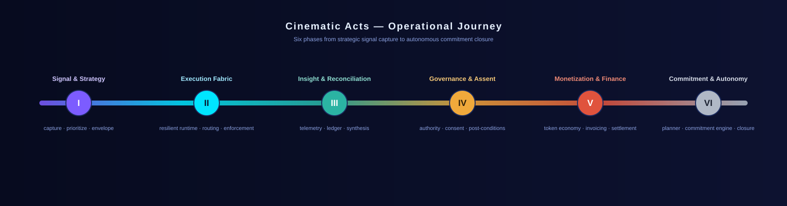
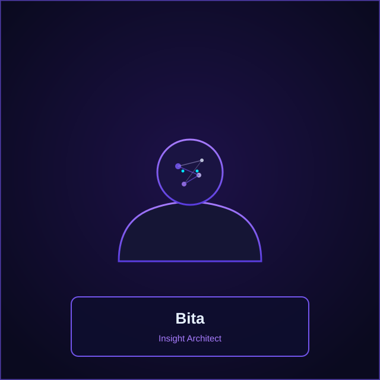
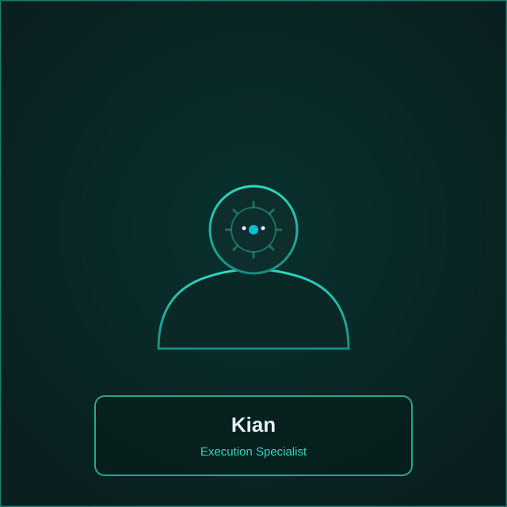
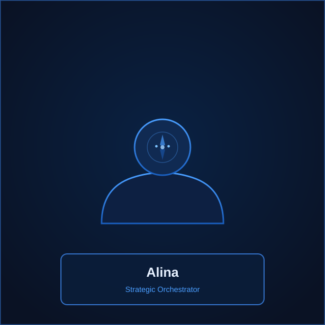
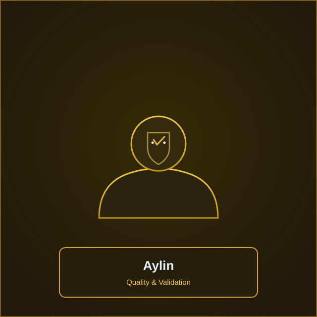
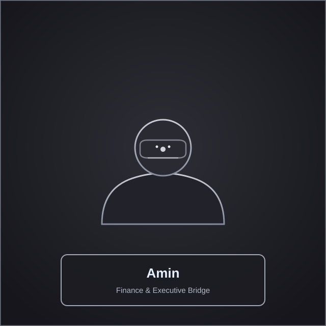

<div align="center">


# AEGIS AGENT
### Multi-Agent SaaS Orchestration Platform

[](https://www.python.org/)
[](https://fastapi.tiangolo.com/)
[](LICENSE)
[](https://github.com/)
[](https://github.com/)

[Quick Start](#quick-start) · [Architecture](#architecture--cinematic-acts) · [Agent Cards](#the-six-agent-cards) · [Auto-Hour](#auto-hour--operational-cadence--verification) · [API Surface](#api-surface--tech-stack)

</div>

---

## Single Source of Truth

Aegis Agent is a **multi-agent SaaS orchestration platform** built on FastAPI and Python 3.11+.
It composes six specialist agents — Bita, Kian, Alina, Aylin, Ahmad, and Amin — into a single
auditable runtime that captures intent, routes execution, validates outcomes, governs authority,
settles financial flows, and closes commitments autonomously.

**Advisory scope:** every agent operates within a guarded boundary. Agents produce
recommendations, evidence, and structured signals; the platform enforces guardrails, consent
checks, and authority matrices before any state-changing action is committed.

**Execution boundary:** the FastAPI application (`app/server.py`) exposes the production
runtime. The `AICore` engine (`core/ai_core.py`) resolves an incoming task to a specialist
agent, runs the workflow, and records evidence into the `EvidenceLedger`. Security policies
(`core/security.py`), FinOps budgets (`core/finops_autopilot.py`), and the authority matrix
(`core/authority_matrix.py`) gate every write path.

> The platform is advisory by default. No agent may bypass the security middleware, the
> FinOps budget enforcer, or the authority matrix. All state changes are ledgered with
> SHA-256 evidence digests for post-incident analysis and executive audit.

---

## Architecture & Cinematic Acts

The platform follows a six-act operational narrative. Each act represents a distinct phase
of the agent lifecycle — from strategic signal capture to autonomous commitment closure.



| Act | Phase | Description | Lead Agent |
|-----|-------|-------------|------------|
| **I** | Signal & Strategy | Capture intent, prioritize signals, envelope constraints | **Alina** |
| **II** | Execution Fabric | Resilient runtime, task routing, retry/backoff, SLA enforcement | **Kian** |
| **III** | Insight & Reconciliation | Telemetry, ledgered evidence, synthesis and risk profiling | **Bita** |
| **IV** | Governance & Assent | Authority matrix, consent, post-condition validation | **Aylin** |
| **V** | Monetization & Finance | Token economy, invoicing, automated settlement flows | **Amin** |
| **VI** | Commitment & Autonomy | Planner, commitment engine, operational closure | **Ahmad** |

### Act Detail

- **Act I — Signal & Strategy:** An incoming task enters through the FastAPI middleware.
  The `AICore` engine evaluates the task text, resolves it to the best specialist agent,
  and records a `route_decision`. Alina's strategic coordination defines the execution
  strategy, routes priorities, and aligns the workflow with policy constraints.

- **Act II — Execution Fabric:** Kian's operational execution takes over. The `RetryGuard`
  wraps each dispatch with bounded retries and circuit-breaker semantics. The `TaskStore`
  tracks lifecycle states (`queued` → `processing` → `completed` | `failed`). Resource
  quotas and token throttling prevent runaway execution.

- **Act III — Insight & Reconciliation:** Bita analyses the execution telemetry,
  synthesizes decision-ready insight, and clarifies dependencies. The `EvidenceLedger`
  appends every action with a SHA-256 digest. The `CausalSwarmObservability` subsystem
  records per-request traces and event timelines for reconciliation.

- **Act IV — Governance & Assent:** Aylin's quality gate validates the outcome against
  deterministic validators and release sigils. The `SecurityPolicy` enforces sanitization
  on every payload. The `AuthorityMatrix` and `ConsentStore` confirm that the actor has
  permission for the requested scope before any post-condition is committed.

- **Act V — Monetization & Finance:** Amin's financial automation bridge handles the
  token economy. `FinOpsAutopilot` enforces per-tenant token budgets. The `FinanceBridge`
  manages invoices and settlement. `FinancialAutomation` auto-pays eligible unpaid
  invoices when executive options permit and sends reminders through registered bridges.

- **Act VI — Commitment & Autonomy:** Ahmad's oversight closes the loop. The
  `CommitmentEngine` records promises (commitments) by actors to execute tasks, tracks
  due dates, and fulfils or cancels them. The autonomous work planner re-evaluates
  priorities and produces a commitment audit trail for executive review.

---

## The Six Agent Cards

Each agent below is presented as an enterprise card: identity, role, mission, scope,
guardrails, and Auto-Hour duty. All agent names are strictly English.

<div align="center">

|  |  |
|:---:|:---:|
| **Bita — Insight Architect** | **Kian — Execution Specialist** |
| **Mission:** Transform raw telemetry into execution-ready insight. | **Mission:** Drive operational workflows to stable delivery. |
| **Scope:** Contextual analysis, signal extraction, risk profiling, and synthesis of dependencies into decision-ready reports. | **Scope:** Runtime flow control, task dispatch, retry/backoff, resource capping, and SLA enforcement across worker agents. |
| **Guardrails:** Privacy-aware processing, consent checks, ledgered provenance for every insight. | **Guardrails:** Authority checks, circuit-breakers, operational quotas, and throughput throttling. |
| **Auto-Hour:** Hourly synthesis jobs, anomaly scoring, and insight-publish audits. | **Auto-Hour:** Execution cadence snapshots, throughput and latency histograms. |

</div>

<div align="center">

|  |  |
|:---:|:---:|
| **Alina — Strategic Orchestrator** | **Aylin — Quality & Validation** |
| **Mission:** Define strategy, route priorities, and align stakeholders. | **Mission:** Verify every outcome before release. |
| **Scope:** Multi-task batching, policy-driven routing, escalation rules, and executive option toggling. | **Scope:** Deterministic validators, test-harness orchestration, release sigils, and evidence-ledger validation. |
| **Guardrails:** Policy engine approvals, executive options, role-based constraints on routing decisions. | **Guardrails:** Signature checks, sandbox probes, and remediation ticket issuance on failure. |
| **Auto-Hour:** Plan re-evaluation, priority drift reports, and decision traces. | **Auto-Hour:** Rolling assurance checks, failed-validation alerts, and remediation tickets. |

</div>

<div align="center">

|  |  |
|:---:|:---:|
| **Ahmad — Security & Oversight** | **Amin — Finance & Executive Bridge** |
| **Mission:** Maintain security posture and govern oversight. | **Mission:** Manage the token economy and bridge executive directives. |
| **Scope:** Bandit/security-scan orchestration, KMS rotation validators, sandboxing, and audit trail management. | **Scope:** Financial automation bridge, charge/settle flows, executive toggles, and token economy management. |
| **Guardrails:** Hardened CI hooks, secure-governance policies, and immutable audit trails. | **Guardrails:** Ledgered financial events, authority matrix enforcement, and fail-safe cancels. |
| **Auto-Hour:** Nightly security sweeps, KMS rotation health, and sandbox probe results. | **Auto-Hour:** Settlement runs, unpaid reconciliation, and executive finance summaries. |

</div>

---

## Auto-Hour — Operational Cadence & Verification

> **Auto-Hour** is the system-wide heartbeat that executes timeboxed automation across all
> six agent portals. Each cycle (configurable; default: 60 minutes) produces an
> **Auto-Hour Report** — a structured evidence artifact for post-incident analysis and
> executive audit.

### Cadence

| Parameter | Default | Description |
|-----------|---------|-------------|
| `cycle_interval` | 60 min | Time between Auto-Hour executions |
| `snapshot_id` | monotonic | Unique identifier per snapshot |
| `timestamp_utc` | ISO 8601 | UTC timestamp of the cycle |
| `evidence_digest` | SHA-256 | Cryptographic digest of all evidence entries in the cycle |

### Report Fields

Every Auto-Hour Report contains:

- **`snapshot_id`** — monotonic identifier for the cycle
- **`timestamp_utc`** — ISO 8601 timestamp
- **`portal_summaries`** — per-portal metrics (`tasks_processed`, `errors`, `throughput`)
- **`evidence_digest`** — SHA-256 summary stored in the Evidence Ledger
- **`verification_checks`** — pass/fail flags for KMS rotation, sandbox probe, QA gates
- **`settlement_actions`** — finance transactions attempted and their results

### Report Format (JSON Sketch)

```json
{
  "snapshot_id": "2026-09-03T12:00:00Z::0001",
  "timestamp_utc": "2026-09-03T12:00:00Z",
  "portal_summaries": {
    "Bita":   {"tasks": 42,  "errors": 0},
    "Kian":   {"tasks": 132, "errors": 2},
    "Alina":  {"tasks": 18,  "errors": 0},
    "Aylin":  {"tasks": 87,  "errors": 1},
    "Ahmad":  {"tasks": 12,  "errors": 0},
    "Amin":   {"tasks": 34,  "errors": 0}
  },
  "evidence_digest": "sha256:1a2b3c...",
  "verification_checks": {
    "kms_rotation": "ok",
    "sandbox_probe": "ok",
    "qa_gates": "ok"
  },
  "settlement_actions": {"attempted": 3, "succeeded": 3}
}
```

### Evidence Ledger Linkage

Auto-Hour retains a strong evidentiary link to the `EvidenceLedger` singleton. Every
portal action appends an entry with `tenant_id`, `actor`, `action`, and `payload`. The
`evidence_digest` in each Auto-Hour Report is a SHA-256 hash over all entries produced
during that cycle. This digest is the primary operational artifact for:

- **Post-incident analysis** — reconstruct the exact sequence of agent actions
- **Executive audits** — verify that guardrails held and budgets were not exceeded
- **Compliance** — demonstrate consent, authority, and security checks were performed
- **Reconciliation** — match financial settlement actions against ledger entries

> The Auto-Hour Report should be treated as a **primary operational artifact**. It is
> the single source of truth for what happened, when, and under whose authority during
> each cycle.

---

## API Surface & Tech Stack

### API Surface

All routes are served by the FastAPI application defined in `app/server.py` and the
routers in `app/api/routes.py`. Routes are prefixed with `/api/v1` where applicable.

| Method | Path | Tag | Description |
|--------|------|-----|-------------|
| `GET` | `/health` | `health` | Liveness probe and operational health snapshot |
| `GET` | `/metrics` | `metrics` | Platform metrics and telemetry snapshot |
| `GET` | `/api/v1/agents` | `agents` | List all registered agents and capabilities |
| `GET` | `/api/v1/agents/{agent_name}` | `agents` | Get a single agent profile by name |
| `GET` | `/api/v1/tasks` | `tasks` | List all tasks with summaries |
| `GET` | `/api/v1/tasks/dispatch` | `tasks` | Preview task dispatch and agent selection |
| `POST` | `/api/v1/tasks/dispatch` | `tasks` | Dispatch a task for asynchronous execution |
| `GET` | `/api/v1/tasks/{task_id}` | `tasks` | Get task status and telemetry by ID |
| `GET` | `/api/v1/tasks/{task_id}/status` | `tasks` | Get task status detail |
| `GET` | `/api/v1/telemetry` | `telemetry` | Runtime telemetry and service metrics |
| `GET` | `/api/v1/diagnostics` | `diagnostics` | Runtime diagnostics and readiness checks |
| `POST` | `/api/v1/tools/issue` | `tools` | Issue a scoped capability token for a tool |
| `POST` | `/api/v1/tools/execute` | `tools` | Execute a tool with a validated capability token |
| `POST` | `/approvals/request` | `diagnostics` | Request approval for a governance action |
| `POST` | `/approvals/{approval_id}/decide` | `diagnostics` | Approve or deny a pending approval |

### Tech Stack

| Component | Technology | Source |
|-----------|-----------|--------|
| **Language** | Python 3.11+ | `pyproject.toml` → `requires-python` |
| **Framework** | FastAPI ≥ 0.110 | `pyproject.toml` → `dependencies` |
| **Server** | Uvicorn ≥ 0.29 | `pyproject.toml` → `dependencies` |
| **Testing** | pytest ≥ 8.0 | `pyproject.toml` → `dev` optional |
| **Linting** | ruff ≥ 0.5 | `pyproject.toml` → `dev` optional |
| **Typing** | mypy ≥ 1.10 | `pyproject.toml` → `dev` optional |
| **Security Scan** | bandit ≥ 1.7 | `pyproject.toml` → `dev` optional |
| **HTTP Test Client** | httpx ≥ 0.27 | `pyproject.toml` → `dev` optional |

### Core Modules

| Module | File | Responsibility |
|--------|------|---------------|
| **AI Core** | `core/ai_core.py` | Agent selection, workflow execution, task dispatch |
| **Agent Registry** | `core/agent_registry.py` | Agent catalog and capability manifests |
| **Security** | `core/security.py` | Payload sanitization, security policy enforcement |
| **Evidence Ledger** | `core/evidence_ledger.py` | Append-only evidence store with SHA-256 digests |
| **FinOps Autopilot** | `core/finops_autopilot.py` | Per-tenant token budgets and usage metering |
| **Finance Bridge** | `core/finance_bridge.py` | Invoice management and settlement |
| **Financial Automation** | `core/financial_automation.py` | Auto-pay and reminder flows |
| **Authority Matrix** | `core/authority_matrix.py` | Permission checks per tenant, actor, and action |
| **Commitment Engine** | `core/commitment_engine.py` | Promise tracking, fulfilment, and cancellation |
| **Model Router** | `core/model_router.py` | Trust-aware model selection and routing |
| **Task Store** | `core/task_store.py` | Task lifecycle with idempotency keys |
| **Observability** | `core/observability.py` | Causal trace and event timeline |
| **Quality Gate** | `core/quality.py` | Production quality validation and release sigils |
| **Retry Guard** | `core/retry_guard.py` | Bounded retries with circuit-breaker semantics |
| **Token Optimizer** | `core/token_optimizer.py` | Throttling and daily budget enforcement |
| **Tool Tokens** | `core/tool_tokens.py` | Scoped capability tokens for tool execution |
| **Tenant Memory** | `core/tenant_memory.py` | Per-tenant memory vault with TTL |
| **Secure Governance** | `core/secure_governance.py` | Policy, consent, and authority authorization |
| **Executive Options** | `core/executive_options.py` | Executive toggle and configuration bridge |
| **Autonomous Planner** | `core/planner.py` | Work planner and priority re-evaluation |

---

## Quick Start

```bash
# Clone the repository
git clone https://github.com/aminazimi42-coder/aegis-agent.git
cd aegis-agent

# Create and activate a virtual environment
python -m venv .venv
source .venv/bin/activate

# Upgrade pip and install the platform
pip install -U pip
pip install -e .

# Start the development server
python -m uvicorn app.server:app --reload
```

Open the interactive API documentation at **http://127.0.0.1:8000/docs**

### Dispatch a Task

```bash
curl -X POST http://127.0.0.1:8000/api/v1/tasks/dispatch \
  -H "Content-Type: application/json" \
  -d '{"task": "Plan the launch and validate the final outcome", "tenant_id": "default"}'
```

### List Agents

```bash
curl http://127.0.0.1:8000/api/v1/agents
```

---

## Validation & Push

Before merging changes into `main`, run the full validation suite:

```bash
# Lint
./.venv/bin/python -m ruff check --fix .

# Tests
./.venv/bin/python -m pytest

# Type check (optional)
./.venv/bin/python -m mypy core/ app/
```

If all checks pass (green), commit and push:

```bash
git add .
git commit -m "docs(readme): cinematic multi-agent README with six agent cards"
git push origin main
```

---

## Execution Footprint

### Evidence Ledger

Every state-changing operation appends an entry to the `EvidenceLedger` with:

| Field | Type | Description |
|-------|------|-------------|
| `tenant_id` | `str` | Tenant scope for the action |
| `actor` | `str` | Agent or system that performed the action |
| `action` | `str` | Action type (e.g. `auto_pay`, `create_commitment`) |
| `payload` | `dict` | Action-specific data |
| `digest` | `str` | SHA-256 hash of the entry |

### FinOps Budget Enforcement

The FinOps Autopilot enforces per-tenant token budgets on every dispatch:

1. `finops_autopilot.enforce_budget(tenant_id, task)` is called in the security middleware
   before any task reaches the dispatch handler.
2. If the daily budget is exhausted, the request is rejected with `429 Too Many Requests`.
3. Usage is recorded via `finops_autopilot.record_usage()` after each successful dispatch.

### Authority Matrix

The authority matrix gates every approval request:

- `human_authority.evaluate_risk(action, context)` returns a risk profile.
- If the profile level is `AUTO`, the action is approved automatically.
- Otherwise, the approval is held as `pending` until a human decides.
- Every approval decision is ledgered with the approver's identity.

---

## Project Structure

```
aegis-agent/
├── agents/                     # Agent implementations
│   ├── alina/                  # Strategic Orchestrator
│   ├── kian/                   # Execution Specialist
│   ├── bita/                   # Insight Architect
│   ├── aylin/                  # Quality & Validation
│   ├── ahmad/                  # Security & Oversight
│   └── amin/                   # Finance & Executive Bridge
├── app/                        # FastAPI application layer
│   ├── server.py               # Application factory and middleware
│   ├── orchestrator.py         # Orchestration layer
│   ├── release.py              # Release utilities
│   ├── health.py               # Health snapshot and status
│   └── api/
│       └── routes.py           # API routers (agents, tasks, telemetry, diagnostics)
├── core/                       # Core platform modules
│   ├── ai_core.py              # Agent selection and workflow engine
│   ├── agent_base.py           # Base agent abstract class
│   ├── agent_registry.py       # Agent catalog
│   ├── authority_matrix.py     # Permission enforcement
│   ├── commitment_engine.py    # Commitment tracking
│   ├── evidence_ledger.py      # Append-only evidence store
│   ├── executive_options.py    # Executive configuration bridge
│   ├── finance_bridge.py       # Invoice and settlement
│   ├── financial_automation.py # Auto-pay and reminders
│   ├── finops_autopilot.py     # Token budget enforcement
│   ├── human_authority.py      # Risk evaluation and approvals
│   ├── model_router.py         # Trust-aware model routing
│   ├── observability.py        # Causal trace and events
│   ├── quality.py              # Production quality gate
│   ├── retry_guard.py          # Retry and circuit-breaker
│   ├── secure_governance.py    # Policy, consent, authority
│   ├── security.py             # Payload sanitization
│   ├── task_store.py           # Task lifecycle store
│   ├── tenant_memory.py        # Per-tenant memory vault
│   ├── token_economy.py        # Token economy
│   ├── token_optimizer.py     # Throttling and budgets
│   └── tool_tokens.py          # Scoped capability tokens
├── tests/                      # Test suite
├── docs/
│   └── assets/                 # SVG visual assets
│       ├── aegis-hero.svg      # Hero banner (1600x420)
│       ├── aegis-acts.svg      # Acts workflow strip (1600x420)
│       ├── agent-bita.svg      # Bita portrait (640x640)
│       ├── agent-kian.svg      # Kian portrait (640x640)
│       ├── agent-alina.svg     # Alina portrait (640x640)
│       ├── agent-aylin.svg     # Aylin portrait (640x640)
│       ├── agent-ahmad.svg     # Ahmad portrait (640x640)
│       └── agent-amin.svg      # Amin portrait (640x640)
├── pyproject.toml              # Project manifest
├── setup.cfg                   # Setup configuration
├── Dockerfile                  # Container (uv-based)
└── README.md                   # This document
```

---

## Contributing

See `CONTRIBUTING.md` for branching strategy, commit message format, and release
playbooks. All substantive changes to agent behavior require a Phase Proposal and an
Auto-Hour simulation report before merge.

### Commit Message Format

```
<type>(<scope>): <subject>

<body>
```

Types: `feat`, `fix`, `docs`, `test`, `refactor`, `chore`, `ci`, `security`
Scopes: `phaseNN`, `readme`, `core`, `api`, `agents`, `tests`

---

## License & Credits

© Azimi Innovation Lab. See `LICENSE` for details.

**Azimi Innovation Lab · Amin Azimi · AI Architect**

> Aegis Agent is a cinematic enterprise multi-agent platform. Every action is ledgered,
> every budget is enforced, and every commitment is tracked to closure.
