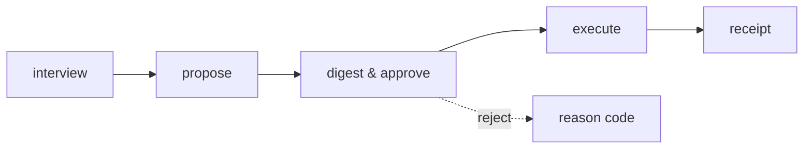

# Aegis Agent

A local-first cognitive twin CLI — a single operator's profile, six proposing specialists, and a human approval gate.

## Pipeline



1. **Interview** — a Day-0 session builds the tenant profile (`core/twin_interview.py`).
2. **Propose** — six specialists propose actions only; nothing executes on its own (`core/twin_actions.py`).
3. **Digest & approve** — the operator reviews the proposed action and approves it, or rejects with a reason code (`duplicate`, `stale`, `unsafe`, `other`).
4. **Execute** — an approved action runs and writes a local outbox file or a `receipts/{action_id}.md` file; nothing sends externally.
5. **Receipt** — every execution produces a local markdown receipt under `AEGIS_DATA_DIR`.

---

## Shipped vs Not shipped

| Shipped | Not shipped |
|---------|-------------|
| Six specialists (Alina, Kian, Bita, Aylin, Ahmad, Amin) propose only | Hosted multi-tenant SaaS / billing / card-charging |
| EchoProvider default LLM (offline echo) | Cloud LLM as default |
| HTTP provider (optional, env-gated) | Payment or license logic inside Aegis |
| Email send to local outbox only | Live SMTP send |
| SQLite persistence under `AEGIS_DATA_DIR` | Packaged desktop app installer |
| Local markdown work products (brief, memo, resume, …) | LangGraph orchestration |
| Hash-bound approve + tenant bind | `desktop_engine.py` and `.market` (quarantined leftovers) |
| Local guards: `complete_safe`, `redact_secrets`, `SecurityPolicy` | |

> `desktop_engine.py` and the `.market` market directory remain in the tree for quarantine tests only — they are not wired into the product and call no external service.

---

## Now

A local digital-twin operator — not a store installer, not a cloud brain. Today it ships:

- **Live demo host** — the live demo is `https://aegis-agent-haka.onrender.com` (health 200 observed 2026-09-15); the dashboard instance class is `0.5c-512mb` (paid), not the old free plan. It is a demo, not the product; local data stays under `$HOME/.aegis`, not on the Render disk. Echo is the default engine; no cloud LLM unless the operator sets an HTTP adapter. Entitlement is a local file. Checkout sidecar is `not_configured` without a key outside git.
- **Public demo rejects raw PAT ingest** — the public Render demo rejects a raw GitHub PAT on `/api/v1/twin/observe/github`; the operator twin is the local page at `127.0.0.1:8741`.

- **Six specialists propose only** — Alina, Kian, Bita, Aylin, Ahmad, Amin; nothing executes without a human approval gate.
- **Hash approve** — approvals bind to the SHA-256 digest of the action payload.
- **Local execute** — approved actions write a local outbox file or a markdown receipt; nothing sends externally.
- **Echo default** — `EchoProvider` is the offline default; no paid LLM is wired unless explicitly configured.
- **Durable profile** — a Day-0 interview builds a consented tenant profile that survives restarts.
- **Approve/reject notes** — every approve or reject writes a feedback row with the actor and timestamp.
- **Local entitlement file** — a signed local file controls the active tier; missing, expired, or mutated files stay Echo-limited, and the file is tenant-bound so a foreign tenant's entitlement never applies. No cloud billing, no card charge.
- **`start_operator.sh` + `.app` wrapper** — a local shell script and a macOS `.app` bundle start the engine; neither is a signed installer or a paid SKU.
- **Optional local HTTP/Ollama adapter** — `AGENT_LLM_BACKEND=ollama` is an alias for the same HTTP complete path; it falls back to Echo when unreachable and is not a bundled binary.
- **Buyer one-pager** — a local ``.md`` export from the saved profile, not a marketing site; written under `AEGIS_DATA_DIR`, never committed.
- **Approved receipts on home** — approved twin actions stay visible on the operator home page after refresh; they do not auto-execute.
- **Engine offline banner** — the operator page shows an honest "Engine offline" banner when the local `/health` probe fails; it is local health, not a cloud SLA.
- **Sole start path** — daily local start is `scripts/start_operator.sh` with data in `$HOME/.aegis` on `127.0.0.1:8741`; it uses the project venv, exports `AEGIS_DATA_DIR`, and prints one English block. There is no second engine launcher.
- **Last reject reason on next card** — when a tenant has a stored reject note, the next propose response includes a `last_reject_reason` field so the operator sees why the prior card was rejected; the field is omitted when no reject exists.
- **Operator Export signed brief** — the operator button POSTs the local signed-export route and shows the returned file path or a typed error; it does not download into the git worktree. Now: the export button is enabled when the local engine is up.
- **Signed-export status depth** — the signed-export click keeps the returned local path and sha256 prefix on the operator page and shows a typed `export_failed:` line when the write fails.
- **No CTO in product copy** — operator-visible copy and specialist proposal templates no longer use the word CTO; the product surface stays neutral.
- **Layer-1 local operator pack** — the pack is built by `scripts/pack_local_operator.sh` into `dist/aegis-local-operator/`; it is unsigned and it does not add Windows support. After the pack, copy `dist/aegis-local-operator` onto the other Mac and run `./scripts/start_operator.sh` from that folder.
- **Packed start is self-contained** — the packed folder starts without git, Hermes, or VS Code; it contains `start_operator.sh`, `INSTALL.md`, and no `_directive.txt` or `.git`.
- **Pack root start path** — the packed folder starts with `./start_operator.sh` at the pack root; copy the folder into the operator home, not Shared, if Shared is not writable.
- **Optional remote license status** — `AEGIS_LICENSE_STATUS_URL` is a labeled GET (default off); when unset the local file stays the only source, when set the remote host can only confirm or report unreachable — it never unlocks a tier when the local file is missing, and no payments live in core. No license host is deployed.
- **Operator entitlement line** — the operator page shows the local tier and expiry, or the Echo-limited phrase when the file is missing, expired, mutated, or bound to another tenant.
- **Pack ships entitlement example** — the local pack ships `entitlement.example.json`; the live entitlement stays under `AEGIS_DATA_DIR` and is never packed.
- **Layer-3 installer folder** — `dist/AegisOperator-mac` is built by `scripts/build_mac_installer.sh`; it is unsigned, the `Install.command` copies `aegis-local-operator` into `$HOME` and creates the venv when missing, Terminal still starts the engine, and no git repo is required on the operator account. The uninstall script leaves `$HOME/.aegis` in place; the installer app is still unsigned.
- **Amin 2026-09-13 installer-path trial** — on 2026-09-13 the amin Mac account copied unsigned `dist/AegisOperator-mac` from Shared after `chmod a+rX`, ran `Install.command --replace`, then created a local `python3.11` venv and `pip install -e .` because `Install.command` does not create `.venv`. `start_operator.sh` bound `AEGIS_DATA_DIR=/Users/amin/.aegis` on `127.0.0.1:8741` and did not open Safari. Session `twin-1ca1a06ea177` prefills Sara Novak / Operator / Europe/Berlin from that account data dir. Approved Alina `act-7142b446680f` and Bita `act-c1c6e615c0bc` persisted from 2026-09-11. `POST /api/v1/twin/brief/signed-export` returned 200 and wrote `/Users/amin/.aegis/export/local_20260912T224141Z.md` sha256 `5007b9cd47d9`; Reveal in Finder opened that file next to the 2026-09-11 exports. Entitlement stayed Echo-limited (missing_file). `Aegis Operator.app` was not opened in this trial. The unsigned installer is not one-click; Terminal venv is still required.
- **Local signed entitlement issuer CLI** — `scripts/issue_entitlement.py` writes a signed local `entitlement.json` under `AEGIS_DATA_DIR`; the default remains Echo-limited when the file is missing; no payments in core.
- **Remote cannot unlock without local file** — a remote license-status body cannot unlock a tier when the local entitlement file is missing, expired, mutated, or bound to another tenant; the remote may only confirm or report unreachable. No license host is deployed.
- **Local quota ledger** — a local `quota.json` under `AEGIS_DATA_DIR` tracks a monthly allowance; remaining zero keeps `complete_safe` on Echo; execute still writes local receipts; no payments in core.
- **Labeled HTTP adapter, no key in core** — the optional HTTP adapter is labeled; a missing key or missing base URL stays Echo; keys live in the environment or `AEGIS_DATA_DIR`, never in the git tree.
- **Developer ID signing + notary profile gate** — `scripts/codesign_operator.sh` signs only when a Developer ID Application identity is present in the keychain; without the identity the script prints `UNSIGNED` and exits 0. After signing it runs `codesign --verify --deep --strict` and prints `SIGNED: <identity>` only if verify exits 0. When `AEGIS_NOTARY_PROFILE` is set the script submits to notarytool with that keychain profile, waits for Apple to report Accepted, and runs `stapler staple` then `stapler validate`; it prints `NOTARY_SKIPPED` and exits 0 when the profile is absent. Without a staple ticket the shipped tree is not claimed as Apple-accepted.  T171 adds the hermesdev-only notary submit path to the docs.
- **2026-09-13 hermesdev laptop smoke** — `start_operator.sh` with `AEGIS_DATA_DIR=$HOME/.aegis` on port 8741; session `twin-d6587b37304f`; Echo-limited `missing_file`; six distinct proposes; Approve Alina `act-ba2c8b6e1d3f` stayed on the Approved strip; signed export `$HOME/.aegis/export/local_20260913T122824Z.md` sha256 `51c0e5085d82`; Reveal in Finder showed that file.
- **Propose confidence** — Propose cards show a local 0–100 confidence integer; scores below 40 ask a clarifying question and still require Approve.
- **Conflict why line** — Propose cards surface a receipt-backed why line and a conflict tag when a new ask collides with a prior action for the same tenant; the why is receipt text, not a new model, and Approve is still required.
- **Tool writes caged to AEGIS_DATA_DIR** — tool-output writes are rejected unless the resolved path is inside `AEGIS_DATA_DIR`; no escape into the git worktree.
- **Status duration and token cost** — the status JSON reports `duration_ms` for the local process window and `http_token_cost` as an integer that is 0 on Echo; no cloud billing is invented.
- **Local entitlement and signed export** — a local entitlement file under `AEGIS_DATA_DIR` and a signed brief export with path plus sha256 are shipped; a missing or expired entitlement returns Echo-limited.
- **Extra secret redaction** — the secret-shape redactor covers bearer tokens and PEM private-key begin markers; it applies on propose body and audit/export text.
- **HTTP adapter timeout** — any labeled HTTP adapter call has a finite timeout (default 8 seconds); on timeout it returns Echo-limited typed English; no worker hangs.
- **Banner reason** — the Echo-limited banner text includes the existing reason token (`missing_file` or `expired`).
- **Single-instance lock** — `start_operator.sh` writes a lock file under `AEGIS_DATA_DIR` recording pid and port; a second start on the same port exits non-zero with the typed English error `port 8741 already in use`; a stale lock from a dead pid is replaced.
- **Status on page** — the Home / Status panel shows `duration_ms` and `http_token_cost` from the platform status JSON alongside the health check; Echo keeps `http_token_cost` at zero.
- **External checkout URL (optional)** — `AEGIS_CHECKOUT_URL` is an optional external link surfaced on the operator status payload; when unset the state is `checkout_unset`; when set the operator sees a text link labeled "External checkout". No card form lives in the twin core; expiry still returns Echo-limited; no paid shop is deployed.
- **Local fulfill outside execute** — `app/licensing/fulfill.py` writes `entitlement.json` only when a local grant (`AEGIS_FULFILL_GRANT`) and issuer key (`AEGIS_ENTITLEMENT_ISSUER_KEY` or key file) are present; a missing grant or key writes nothing. Execute does not take payment; no paid shop is deployed.
- **Loop depth from durable notes and profile** — the next propose response reads the last reject reason and last approve note from the durable feedback store and includes both when present; the weekly brief uses the saved profile name, role, goals, and timezone; the Approved strip stays. This is Echo, not a multi-month behavioral twin.
- **Receipt depth: correlation id, note hash, digest preview, Intact/Tampered** — one local correlation id ties propose, approve, receipt, and audit for the same action; the receipt chain includes a hash of the operator note when a note exists; the operator page shows a digest preview before Approve; a local verify-chain helper reports Intact or Tampered.
- **Path cage and extra redact** — every operator file write is caged to `AEGIS_DATA_DIR`; a path outside that dir returns a typed `path_denied_outside_data_dir` deny and does not write; bearer tokens, webhook query secrets, and SSH private-key blocks are redacted on propose, execute logs, and audit.
- **Missing vs expired banners** — the operator page shows a distinct `Echo-limited (missing_file)` banner when the local entitlement file is absent and `Echo-limited (expired)` when the file exists but the expiry is in the past; both stay Echo-limited; the file is not unlocked without the local file.
- **HTTP adapter timeout to Echo** — when `AGENT_LLM_BASE_URL` is set, the HTTP call has a finite timeout (default 8 seconds); on timeout it falls back to Echo and labels the fallback `adapter_timeout`; the operator page does not hang.
- **start_operator preflight** — `scripts/start_operator.sh` checks for a usable `python3` (prefers 3.11) and verifies that port 8741 is free or already this engine before bind; it exits non-zero with a typed English line when either check fails; it does not open Safari.
- **Profile schema on load and detached brief signature** — loading a profile that fails schema validation returns a typed `profile_invalid` error and does not crash the operator page; a valid profile still prefills. Signed export writes the markdown brief and a sibling `.sig` file under `AEGIS_DATA_DIR/export`; a local verify helper reports Intact or Tampered.
- **Stripe checkout sidecar outside execute** — `app/licensing/billing_checkout.py` `create_checkout_intent()` returns `not_configured` when `STRIPE_SECRET_KEY` is unset (default in tests and CI) and never calls the network; a local issuer writes `entitlement.json` with `source` under `AEGIS_DATA_DIR`; execute and propose read the file only; a forged header or remote 200 without the file cannot raise the tier. Payment is outside this page. No paid shop is deployed.
- **Shop event handler outside execute** — `app/licensing/billing_event.py` `handle_checkout_event()` returns `not_configured` when `STRIPE_WEBHOOK_SECRET` is unset and writes nothing; a valid completed event may call the local issuer to write `entitlement.json`; an invalid signature is rejected with no write; an unknown event type is ignored. The handler is never imported from execute or propose. No card form in core.
- **Notary submit-only helper** — a local Developer ID signature exists on the operator app; `scripts/notarize_submit.sh` can send a zip to Apple Notary when `AEGIS_NOTARY_PROFILE` is set and prints a submission id; without the profile it prints `NOTARY_PROFILE_MISSING` and exits 0. Gatekeeper still rejects a Developer ID app without a staple ticket.
- **Notary staple helper** — `scripts/notarize_staple.sh` checks an existing notary submission and staples the signed app only when Apple reports Accepted; without a profile or submission id it prints `NOTARY_PROFILE_MISSING` or `NOTARY_PENDING` and exits 0. The success word prints only if `stapler validate` exits 0 on this machine; otherwise the app is not claimed as staple-validated.
- **One notary operator wrapper** — `scripts/notarize_operator.sh` calls the submit helper (T183) then the staple helper (T184) in order; it does not reimplement zip, submit, or staple. Without `AEGIS_NOTARY_PROFILE` it prints `NOTARY_PROFILE_MISSING` and exits 0. Gatekeeper still rejects a Developer ID app without a staple ticket on this machine; T188 billing stays locked this slice.
- **Local license issuer outside execute** — a local issuer writes `entitlement.json` under `AEGIS_DATA_DIR` only; `execute`, `propose`, and `complete_safe` read that file only — they do not call the issuer, do not import Stripe, and do not call the network; a missing, unreadable, or expired file is Echo-limited; a forged header or a remote 200 without the local file cannot raise the tier.

---

## Destination — Planned

The road ahead, not yet shipped:

- **Double-click installer** — a packaged desktop binary the operator can install without a terminal.
- **Local model on the existing adapter** — a model that runs on the operator's machine through the current HTTP adapter, not a new cloud dependency.
- **Weekly-brief button** — one click renders the weekly brief from the existing morning-brief renderer.
- **Multi-week style loop** — the writing-style lock extended across multiple weeks of samples.
- **License server outside core** — a separate license server; the core repository stays payment-free.
- **Professional, then Executive, then Engineering** — tier rollout in that order; each tier is a local entitlement file, not a card charge.
- **Payments never enter core** — billing, if any, lives outside this repository; `core/` stays free of payment logic.
- **Mac installer trial and Developer ID** — the Mac installer folder will be trialed on owner and amin accounts; signing requires a Developer ID, and the license host remains outside this repo.
- **Planned: staple, stranger giveable open, live Stripe shop, deployed license host** — a notary staple ticket, a stranger giveable open, a live Stripe account, a deployed license host, and a Developer ID staple for the installer are planned, not shipped; they remain locked. T188 event handler exists; the owner sets keys outside git and points a Stripe webhook at a process that is not the twin execute path.

---

## Specialists

Six agents registered in the specialist catalog. Each **proposes only** — a human must approve before anything executes.

| Agent | Role |
|-------|------|
| **Alina** | Strategic coordination |
| **Kian** | Operational execution |
| **Bita** | Analysis and synthesis |
| **Aylin** | Quality and validation |
| **Ahmad** | Security and oversight |
| **Amin** | Finance and executive bridge |

---

## CLI commands

All commands are in `tools/twin_cli.py`. Each prints a JSON object to stdout
and exits 0 on success; `ValueError` / `PermissionError` prints
`{"error": str}` and exits 2.

```bash
python tools/twin_cli.py <command> [options]
# alias:  alias aegis="python tools/twin_cli.py"
# then:   aegis propose --tenant <ID>
```

### Interview & profile

| Command | Key flags | Description |
|---------|-----------|-------------|
| `status` | — | Print platform status |
| `interview-start` | `--tenant` | Start a Day-0 interview session |
| `interview-answer` | `--session --question --text` | Submit one interview answer |
| `interview-commit` | `--session --consent` | Commit the interview as a profile |
| `style-lock` | `--tenant --dir` | Lock writing style from local text samples |

### Propose / approve / execute

| Command | Key flags | Description |
|---------|-----------|-------------|
| `actions-propose` | `--tenant` | Propose twin actions from profile + digest |
| `actions-approve` | `--action-id --tenant --actor --expected-payload-sha256` | Approve a proposed action (human gate) |
| `actions-reject` | `--action-id --tenant --reason` | Reject with a reason code (`duplicate`/`stale`/`unsafe`/`other`) |
| `actions-execute` | `--action-id --tenant` | Execute an approved action |
| `render` | `--tenant` | Render weekly plan + review notes |
| `goal-plan` | `--tenant --text` | Turn goal text into an ordered proposed-action plan |

### Calendar & schedule

| Command | Key flags | Description |
|---------|-----------|-------------|
| `calendar-ics` | `--tenant --path` | Ingest a local `.ics` calendar file |
| `schedule` | `--tenant --title --due [--timezone]` | Schedule a durable commitment job |
| `schedule-tick` | `[--now]` | Tick the scheduler — mark due jobs |
| `focus-block` | `--tenant --start [--duration] [--title]` | Create a focus-block hold |

### Work products

| Command | Key flags | Description |
|---------|-----------|-------------|
| `brief-morning` | `--tenant` | Render a one-page morning brief |
| `brief-meetings` | `--tenant` | Render per-meeting briefs |
| `followups` | `--tenant` | Render the follow-up list |
| `delegate` | `--tenant` | Render the delegate pack |
| `board-memo` | `--tenant` | Render a one-page board weekly memo |
| `resume` | `--tenant` | Render a one-page principal resume |
| `travel` | `--tenant [--dir]` | Render a one-page travel pack |
| `decision-record` | `--tenant --title --decision --reason` | Record a yes/no decision |
| `decision-list` | `--tenant [--query]` | List recorded decisions |
| `pr-review` | `--tenant --diff` | Turn a local diff into PR review notes |
| `expenses` | `--tenant --dir` | Ingest receipt `.txt` files into expense notes |
| `team-inbox` | `--tenant --file` | Triage a team-chat export |
| `transcript-task` | `--tenant --file` | Turn a transcript `.txt` into a proposed action (audio-task sidecar supported) |

### Email

| Command | Key flags | Description |
|---------|-----------|-------------|
| `email-triage` | `--tenant --dir` | Triage a folder of `.eml` files |
| `email-send` | `--tenant --action` | Send an approved email draft to **local outbox only** |

---

## Twin API routes

Served by the FastAPI app in `app/server.py` under `/api/v1/twin`:

| POST route | Description |
|------------|-------------|
| `/api/v1/twin/session/start` | Start a Day-0 interview session |
| `/api/v1/twin/session/{session_id}/answer` | Submit an interview answer |
| `/api/v1/twin/session/{session_id}/commit` | Commit the interview as a profile |
| `/api/v1/twin/events` | Ingest a work event and evolve the twin |
| `/api/v1/twin/observe/git` | Observe a local git repo |
| `/api/v1/twin/observe/github` | Observe a GitHub repo via PAT |
| `/api/v1/twin/behavior/rebuild` | Rebuild the versioned behavioral snapshot |
| `/api/v1/twin/work-products/render` | Render local work-product files |
| `/api/v1/twin/calendar/ics` | Ingest a local `.ics` calendar file |
| `/api/v1/twin/brief/morning` | Render a one-page morning brief |
| `/api/v1/twin/email/triage` | Triage a folder of `.eml` files |
| `/api/v1/twin/brief/meetings` | Render per-meeting briefs |
| `/api/v1/twin/followups/render` | Render the follow-up list |
| `/api/v1/twin/delegate/render` | Render the delegate pack |
| `/api/v1/twin/decisions` | Record a yes/no decision |
| `/api/v1/twin/style/lock` | Lock writing style from local samples |
| `/api/v1/twin/pr/review` | Turn a local diff into PR review notes |
| `/api/v1/twin/expenses/ingest` | Ingest receipt `.txt` files |
| `/api/v1/twin/focus/block` | Create a focus-block hold |
| `/api/v1/twin/travel/render` | Render a travel pack |
| `/api/v1/twin/team/inbox` | Triage a team-chat export |
| `/api/v1/twin/transcript/task` | Turn a transcript into a proposed action |
| `/api/v1/twin/audio/task` | Turn an audio file + sidecar into a proposed task |
| `/api/v1/twin/memo/board` | Render a one-page board weekly memo |
| `/api/v1/twin/resume/render` | Render a one-page principal resume |
| `/api/v1/twin/email/send` | Send an approved email draft to local outbox |
| `/api/v1/twin/actions/propose` | Propose twin actions |
| `/api/v1/twin/actions/{action_id}/approve` | Approve a proposed action |
| `/api/v1/twin/actions/{action_id}/reject` | Reject a proposed action with a reason code |
| `/api/v1/twin/actions/{action_id}/execute` | Execute an approved action |

Additional GET routes: `/api/v1/twin/profile/{tenant_id}`,
`/api/v1/twin/digest/{tenant_id}`, `/api/v1/twin/behavior/{tenant_id}`,
`/api/v1/twin/decisions/{tenant_id}`, `/api/v1/twin/actions/{tenant_id}`,
and `/api/v1/platform/status`.

---

## Errors

Twin API routes return a unified 400 body on `ValueError` (`core/api_errors.py`):

```json
{"detail": "<message>", "code": "TWIN_NO_PROFILE", "request_id": "<uuid4 hex>"}
```

`code` is a stable string from a known-message map (`TWIN_NO_PROFILE`,
`TWIN_ACTION_MISSING`, `TWIN_NOT_APPROVED`, …) or the fallback `TWIN_ERROR`.
`detail` is `str(exc)` unchanged.

---

## LLM provider

| Provider | When |
|----------|------|
| **EchoProvider** (default) | `AEGIS_LLM_PROVIDER` unset or not `http` — offline echo, no paid LLM |
| **HttpProvider** (optional) | `AEGIS_LLM_PROVIDER=http` **and** both `AEGIS_LLM_BASE_URL` + `AEGIS_LLM_API_KEY` set |

All LLM completions go through `core/llm_safety.py` → `complete_safe` (tool allow-list cage) and `redact_secrets` (strips `AEGIS_LLM_API_KEY` / `AEGIS_GITHUB_TOKEN`).  These are local guards; they call no external service.

---

## Data

State is **SQLite** under `AEGIS_DATA_DIR` (defaults to `data/`).  Work products render as local markdown files under the same root.  The live demo at `https://aegis-agent-haka.onrender.com` runs on a paid `0.5c-512mb` Render instance; it is a demo, not the product.  The product loop stays local: `start_operator.sh`, `$HOME/.aegis`, port `8741`.  SQLite files persist on the demo host only if a volume is mounted.

```bash
# local dev
AEGIS_DATA_DIR=./data uvicorn app.server:app --reload

# run the suite
./.venv/bin/python -m pytest -q
./.venv/bin/python -m ruff check .
```

Interactive API docs at **http://127.0.0.1:8000/docs** when the server is running.

---

## CI

`.github/workflows/ci.yml` runs **ruff check** and **pytest -q** on Python 3.11 for every push and pull request to `main`.

---

## Author

Aegis Agent is a local-first FastAPI cognitive-twin for one senior operator: consented profile, proposed actions, human approval, and local work products. Version 1.0.0-rc1. Created 2026. Developer: Amin Azimi. Brands: AI Architect Amin Azimi — End-to-End System Development, and Azimi Innovation Lab.

## License

Licensed under the Apache License, Version 2.0. See `LICENSE` for the full text.
Copyright 2026 Amin Azimi — AI Architect Amin Azimi — End-to-End System Development, Azimi Innovation Lab.
